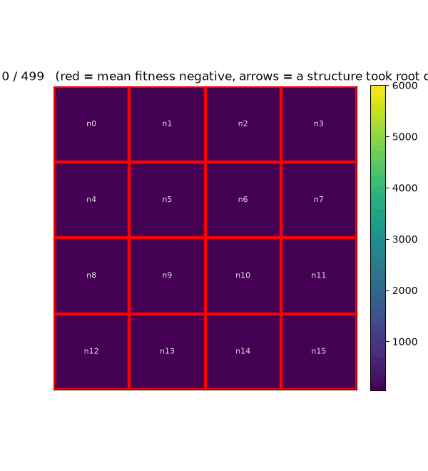

# GADS_network

Reference implementation of networked **Generative Adaptive Dynamical Systems
(GADS)** exchanging self-authored representations through bounded local
interfaces.

Each node is a complete GADS with its own population, Meta-Genome,
representational history, and random process. Nodes do not share populations,
fitness values, internal state, or a global representation. They exchange
compositions that their own local dynamics have created.

The network has no barrier, consensus round, shared generation clock, or central
controller. One master process starts the nodes and collects telemetry, but it
does not participate in their dynamics.

For the single-system implementation, see
[GADS_single](https://github.com/ML-flash/GADS_single).

## Demonstration



The visualization follows sixteen independent GADS nodes arranged as a 4 x 4
torus. Each cell is one complete system, and its color tracks local mean fitness.
Arrows appear when a composition created by one node crosses a network edge and
takes root in a neighbor. The important event is the arrival of a reusable piece
of representation. The receiving node admits that structure to its own
Meta-Genome, after which its local population determines whether the structure
is used and survives.

## Start here

Python 3.11 or newer is recommended. No third-party packages are required.

```bash
git clone https://github.com/ML-flash/GADS_network.git
cd GADS_network
python run.py --config config.smoke.json --no-save
```

The smoke configuration runs four nodes on a bounded grid against a sampled
20-MUX environment. It is designed to exercise capture, exchange, arrival, and
local reuse quickly.

The default `config.json` is a larger 16-node torus configuration:

```bash
python run.py
```

## What is being networked?

A GADS authors new representational units by capturing structures that arise in
its population. In the single-system case, those compositions can only be
reused where they were created. In this implementation, a mature composition
may also cross a network edge and become available to a neighboring GADS.

The transmitted object is the composition itself. Compositions carry their
content by value as immutable tuples, so another node can receive and use one
without sharing an identifier table, cache, or global namespace.

This encoding makes the network possible without a representational controller.
A composition recursively contains the atoms and compositions from which it was
built. Its structure is its identity. The same value can cross a process
boundary and still mean the same thing at the receiving node because decoding
depends only on the value itself, not on state held by its creator.

That gives exchange four useful properties:

* **Self-contained.** A packet carries the structure needed to decode it. There
  is no second lookup against a shared registry.
* **Namespace-free.** Nodes do not have to agree on locally assigned identifiers
  or translate between private symbol tables.
* **Idempotent.** Structural equality tells a node whether an arriving
  composition is already active, so repeated arrivals do not create separate
  copies of the same representation.
* **Locally governed.** Arrival makes a composition available for sampling. It
  does not force the population to use it or protect it from later removal.

The relevant mechanics are visible in the
[value-based Meta-Genome and decoder](GADS.py#L170-L191) and the
[exchange and admission loop](run.py#L224-L258).

Exchange does not transfer:

* organisms or populations,
* fitness scores,
* mutation decisions,
* instructions about how a neighbor should use the structure,
* a model of the network's desired state.

A received composition enters the neighbor's local proposal distribution. Its
survival and use are then determined by that node's own population.

## Network model

Every node runs in its own operating-system process with:

* a private GADS population,
* a private Meta-Genome,
* its own evolutionary random seed,
* an inbox,
* outgoing queues connected only to its neighbors.

Supported bounded topologies are:

| Topology | Exchange behavior                                          |
| -------- | ---------------------------------------------------------- |
| `line`   | Send each eligible batch to every adjacent node            |
| `ring`   | Send each eligible batch to both adjacent nodes            |
| `grid`   | Send each eligible batch to one randomly selected neighbor |
| `torus`  | Send each eligible batch to one randomly selected neighbor |

Grid and torus exchange uses one randomly selected neighbor rather than
broadcasting across every edge. Torus node counts must be perfect squares.

A newly captured composition becomes eligible to leave its node when it reaches
`share_min_age`. Incoming structures are processed only after the node has
fixed its outgoing batch for that generation. This prevents a structure from
crossing several nodes as a same-generation forwarding cascade.

A received structure that is already locally active is idempotent. A novel
arrival receives a short `arrival_grace`, giving local sampling a chance to
place it into an organism before ordinary participation-based removal applies.
Arrival grace provides reachability, not permanent protection.

## Local generation lifecycle

Each node independently repeats:

1. Select the current generation's environmental evaluation cases.
2. Collect applicable structural rewrites through decode.
3. Decode and evaluate every organism against the same cases.
4. Derive the node's current top-level composition service set.
5. Apply local recolonization if one structure dominates beyond the configured
   threshold.
6. Remove locally unused compositions and inline their content.
7. Reproduce and mutate the local population.
8. Identify newly mature local compositions and send them through bounded
   outgoing edges.
9. Drain the local inbox and admit novel arrivals.

Nodes perform this loop asynchronously. Local generation 100 on one node need
not occur at the same wall-clock moment as local generation 100 on another.

## Generation-sampled MUX

Exhaustive multiplexer evaluation grows exponentially:

| MUX | Selection lines | Inputs |   Complete rows |
| --: | --------------: | -----: | --------------: |
|   6 |               2 |      6 |              64 |
|  11 |               3 |     11 |           2,048 |
|  20 |               4 |     20 |       1,048,576 |
|  37 |               5 |     37 | 137,438,953,472 |

Materializing the complete truth table becomes unnecessary and eventually
impossible. The evaluator instead treats the integer range from zero through
`2^inputs - 1` as the complete input mapping. For every sampled row identity,
it derives the selection bits, data bits, and correct output exactly.

At the start of each local generation:

1. `sample_rows` unique row identities are drawn without replacement.
2. Their input columns and expected outputs are compiled into bitmasks.
3. Every organism at that node is evaluated against that same sample.
4. The next generation receives a newly drawn sample.

The evolutionary random stream and environmental sampling stream are separate.
Changing the number of sampled rows does not consume mutation or selection
randomness. Every node uses the same `sample_seed`, so the same local generation
number corresponds to the same evaluation cases without communication or a
shared clock.

Sampling changes the presented cases through time while preserving a common
basis for differential survival within each node and generation.

Valid MUX sizes have the form `S + 2^S`: 6, 11, 20, 37, 70, and so on.

Example:

```bash
python run.py \
  --config config.smoke.json \
  --mux-size 37 \
  --sample-rows 512 \
  --sample-seed 7 \
  --no-save
```

When `sample_rows` equals the complete row count, evaluation is exhaustive and
the sample remains fixed because it already contains every possible case.

## Fitness function design

A fitness function defines how each completed decoded construction encounters an
environment. It receives atoms and returns a numerical score. Selection acts on
those scores within the node that produced them.

Fitness does not travel with a shared composition. When a composition reaches a
neighbor, it becomes part of that node's available representational language.
Its value is determined only if local sampling places it into an organism and
that organism is evaluated in the receiving node's environment.

The evaluator receives decoded atoms. It does not inspect the Meta-Genome,
direct how a composition should be organized, repair unsuccessful structures,
or preserve a composition on the basis of an external model.

A fitness design specifies:

| Part             | Question                                                                                  |
| ---------------- | ----------------------------------------------------------------------------------------- |
| Atomic alphabet  | What primitive elements can a decoded construction contain?                               |
| Interpreter      | How does the environment execute or evaluate that sequence?                               |
| Valuation        | What behavior receives greater or lesser value?                                           |
| Failure and cost | How are malformed constructions, resource use, excess length, or invalid behavior scored? |
| Evaluation cases | Are all cases evaluated, or is a reproducible sample presented each generation?           |

MUX is the supplied example environment. It interprets a decoded sequence as a
postfix Boolean program, compares its result with known outputs, and calculates
a score from correctness and the selected cost terms. MUX is not part of the
definition of GADS.

For a networked experiment, shared compositions require a shared atomic
meaning. Every node must interpret an atom in the same way. Nodes may encounter
different environmental cases or valuation conditions, but a transferred
composition must decode consistently at every node.

The present runner gives every node the same MUX configuration and sampling
seed. Equal local generation numbers receive equal sampled cases, while nodes
still progress independently in wall-clock time. This makes scores comparable
within a local generation without requiring a synchronization barrier.

## Implementing another environment

The core environment interface is:

```python
atoms
score(atoms)
```

`atoms` supplies the primitive alphabet. `score(atoms)` receives the decoded
atomic construction and returns its fitness value.

The current `bind_mux()` function shows how to bind an environment to each node:

```python
G.FITNESS = fit
G.ATOMS = fit.atoms
G.N_BASE = len(fit.atoms)
G.BASE_GENES = list(range(2, 2 + G.N_BASE))
G.FIRST_COMP_ID = 2 + G.N_BASE
```

Binding occurs inside `node_worker()` before a node creates its population.
Every node must receive a compatible alphabet.

A static environment can bind once and score every local generation against the
same conditions. A changing environment should prepare its next conditions
before `G.evaluate_population()` runs. The supplied MUX environment does this
with `fit.resample(case_rng)`.

Keep the environmental random stream separate from evolutionary randomness.
Changing evaluation cases should not also alter mutation, selection, or
reproduction through unintended consumption of the same random stream.

Replacing MUX also requires updating MUX-specific configuration, result
metadata, validation, and output in `run.py`. The current runner assumes MUX
size, scoring, sampled rows, a sample seed, and a complete row count.

Verify a new environment in stages:

1. Score known successful, unsuccessful, and malformed constructions directly.
2. Confirm that the same decoded atom sequence receives the same score on two
   nodes when their evaluation conditions are identical.
3. If nodes use different conditions, record those conditions with their
   results so score differences have an identifiable source.
4. Evaluate evolved constructions against held-out cases when generalization is
   part of the question.

## Why this architecture has room to scale

The implementation removes several sources of coordination cost that would
otherwise grow with the network. This is a statement about the architecture,
not a claim that useful adaptation or execution speed scales linearly.

| Property                 | Scaling consequence                                                                                                  | Implementation                                 |
| ------------------------ | -------------------------------------------------------------------------------------------------------------------- | ---------------------------------------------- |
| Bounded neighborhoods    | A node has at most two neighbors in a line or ring and four in a grid or torus, independent of total network size    | [Topology construction](run.py#L85-L120)       |
| By-value compositions    | Representation can move without a global name service, ownership table, or translation step                          | [Composition semantics](GADS.py#L170-L191)     |
| Asynchronous nodes       | Progress does not require a generation barrier or waiting for the slowest node                                       | [Independent worker loop](run.py#L164-L191)    |
| Selective local exchange | Grid and torus nodes send an eligible batch through one selected edge rather than broadcasting it across the network | [Bounded exchange](run.py#L232-L245)           |
| Sampled environments     | MUX evaluation materializes and evaluates `sample_rows` cases rather than all `2^inputs` cases                       | [Sample compilation](mux_fitness.py#L143-L185) |

For the supported topologies, per-node neighborhood size remains bounded as more
nodes are added. Total computation and communication still grow with the number
of nodes, and the current Python multiprocessing and telemetry implementation
may introduce practical bottlenecks. The design supports horizontal
experimentation without introducing a global representation service or a
synchronization step into the dynamics. Throughput, convergence, and the effect
of network size remain measurements to be made rather than results claimed
here.

## GADS representation

An organism contains atoms, paired boundary markers, and compositions.

* Boundaries create temporary local regions and cannot nest.
* Capture replaces a bounded span with a composition carrying that span.
* Open exposes a composition's contents to further mutation.
* MCO sampling makes active compositions available for reuse.
* Participation removes structures that are no longer held at top level.
* Inlining conserves decoded atomic content when a composition dies.

The external MUX environment receives only decoded atoms. It assigns value to
the construction presented by an organism but cannot inspect or direct the
representational structure that produced it.

## Files

| File                    | Purpose                                                         |
| ----------------------- | --------------------------------------------------------------- |
| `GADS.py`               | GADS machine used independently by every node                   |
| `run.py`                | Topology, multiprocessing workers, exchange, telemetry, and CLI |
| `mux_fitness.py`        | Exhaustive and generation-sampled MUX evaluation                |
| `config.json`           | Default 16-node configuration                                   |
| `config.smoke.json`     | Fast four-node MUX20 validation configuration                   |
| `test_mux_sampling.py`  | Mapping, determinism, resampling, and scale checks              |
| `test_network_smoke.py` | Bounded asynchronous exchange regression                        |

## Configuration

Top-level run settings:

| Setting             | Meaning                                            |
| ------------------- | -------------------------------------------------- |
| `seed`              | Base node seed; node `i` receives `seed + i`       |
| `generations`       | Local generations executed by every node           |
| `telemetry_every`   | Local-generation interval for structural telemetry |
| `show_progress`     | Enable master-process heartbeat reporting          |
| `heartbeat_seconds` | Wall-clock interval between heartbeat lines        |
| `save_result`       | JSON result path, or `null`                        |

Network settings:

| Setting                 | Meaning                                                          |
| ----------------------- | ---------------------------------------------------------------- |
| `topology`              | `line`, `ring`, `grid`, or `torus`                               |
| `nodes`                 | Number of independent GADS processes                             |
| `share_min_age`         | Local age at which a captured composition is shared              |
| `arrival_grace`         | Unheld sweeps a novel arrival may survive                        |
| `singularity_threshold` | Local dominant-composition fraction that triggers recolonization |

MUX settings:

| Setting       | Meaning                                                    |
| ------------- | ---------------------------------------------------------- |
| `size`        | Total MUX input count: 6, 11, 20, 37, 70, ...              |
| `scoring`     | `original` or `rebalanced`                                 |
| `sample_rows` | Unique input/output cases evaluated per generation         |
| `sample_seed` | Independent seed controlling the changing evaluation cases |

The `gads` section exposes the population size, selection, boundary, capture,
open, mutation, MCO, and lifecycle parameters used by each node.

Command-line overrides are available for the most common run changes:

```bash
python run.py --help
```

## Output

The saved JSON contains:

* execution model and topology,
* node and sampling seeds,
* MUX size, sample size, and complete mapping size,
* per-node fitness curves and Meta-Genome summaries,
* capture, deletion, exchange, arrival, and recolonization totals,
* the number of structurally unique compositions at the final telemetry point.

The master process is observational. Telemetry does not feed back into node
selection, mutation, exchange, or recolonization.

## Validation

Run:

```bash
python -m py_compile GADS.py mux_fitness.py run.py test_mux_sampling.py test_network_smoke.py
python test_mux_sampling.py
python test_network_smoke.py
```

The sampling regression verifies exhaustive 6-MUX behavior, exact sampled
input/output mappings, deterministic sample sequences, changing cases between
generations, and sampled construction of MUX37 without materializing its full
truth table.

The network smoke exercises real multiprocessing queues and requires structures
to be captured, sent, and received.

## What this repository establishes

This repository establishes an executable reference for representation exchange
between autonomous GADS nodes through bounded interfaces. It provides machinery
for observing network dynamics without giving the observer control over them.

It does not establish that exchange is beneficial under every parameterization,
that larger networks are necessarily more capable, or that the architecture
alone guarantees stable dynamics, adaptation, or biological equivalence. Those
remain empirical questions.

For the conceptual introduction, see
[What Is GADS?](https://www.fsadb.org/what-is-gads/).

For the architectural derivation, see
[GADS Foundations](https://www.fsadb.org/gads-foundations/).

For the single-system implementation, see
[GADS_single](https://github.com/ML-flash/GADS_single).

## License

GNU General Public License v3.0. See [LICENSE](LICENSE).
